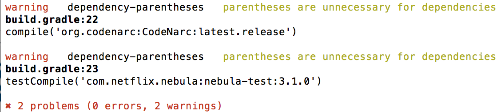
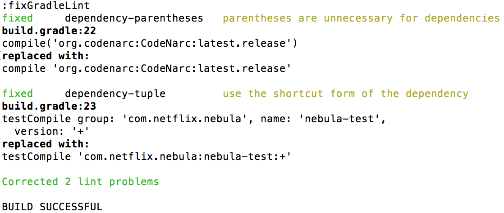

# Gradle Lint Plugin

## Table of Contents

<!-- START doctoc generated TOC please keep comment here to allow auto update -->
<!-- DON'T EDIT THIS SECTION, INSTEAD RE-RUN doctoc TO UPDATE -->
- [Purpose](#purpose)
- [Usage](#usage)
- [Tasks](#tasks)
  - [Running the linter](#running-the-linter)
  - [Auto-fixing violations](#auto-fixing-violations)
  - [Generating a lint report](#generating-a-lint-report)
- [Force the linter to ignore a piece of code](#force-the-linter-to-ignore-a-piece-of-code)
- [Building your own rules](#building-your-own-rules)
  - [The `Rule` implementation](#the-rule-implementation)
  - [The properties file](#the-properties-file)
  - [Grouping rules](#grouping-rules)
- [Rule listing](#rule-listing)
  - [Included rules](#included-rules)
  - [Rule wish list](#rule-wish-list)
- [License](#license)

<!-- END doctoc generated TOC please keep comment here to allow auto update -->

## Purpose

The Gradle Lint plugin is a pluggable and configurable linter tool for identifying and reporting on patterns of misuse or deprecations in Gradle scripts.  It is inspired by the excellent ESLint tool for Javascript and by the formatting in NPM's [eslint-friendly-formatter](https://www.npmjs.com/package/eslint-friendly-formatter) package.

It assists a centralized build tools team in gently introducing and maintaining a standard build script style across their organization.

## Usage

To apply this plugin:

    plugins {
      id 'nebula.lint' version '0.10.0'
    }

Alternatively:

    buildscript {
      repositories { jcenter() }
      dependencies {
        classpath 'com.netflix.nebula:gradle-lint-plugin:latest.release'
      }
    }

    apply plugin: 'nebula.lint'

Define which rules you would like to lint against:

    gradleLint.rules = ['dependency-parentheses', 'dependency-tuple', ...]

For an enterprise build, we recommend defining the lint rules in a `init.gradle` script or in a gradle script that is included via the Gradle `apply from` mechanism.

For multimodule projects, we recommend applying the plugin in an allprojects block:

    allprojects {
      apply plugin: 'nebula.lint'
      gradleLint.rules = ['dependency-parentheses', 'dependency-tuple', ...]
    }

## Tasks

### Running the linter

When `nebula.lint` is applied, build scripts will be automatically linted by a task called `lintGradle` after the last task in the task graph executes. Results are held until after the last task is ran, then reported in the console.

So as not to interfere with common informational tasks, linting does not run if the only tasks in the task graph are 'dependencies', 'dependencyInsight', 'help', 'components', 'projects', 'model', or 'properties'.

### Auto-fixing violations

Run `./gradlew fixGradleLint` (or `./gradlew fixLintGradle`, which is an alias) to automatically fix your build scripts!  The auto-fix process lists all violations and how they were fixed (when a fix was possible):

### Generating a lint report

Run `./gradlew generateGradleLintReport` to generate a separate report.  By default, this task is configured to generate an HTML report.  You can change the default by setting:

    gradleLint.reportFormat = 'xml' // or 'text' or the default of 'html'

## Force the linter to ignore a piece of code

When you wish to force the linter to ignore a block of build script code that it believes is in violation, you can surround the code with a block like:

    gradleLint.ignore {
      // my build script code that makes the linter suspicious...
    }

You can also be selective about which rules to ignore in the block by providing up to 5 arguments to `ignore`:

    gradleLint.ignore('dependency-parentheses', 'dependency-tuple') {
      // here I want to use a non-idiomatic dependency syntax, but lint for everything else
    }

## Building your own rules

A lint rule consists of a `GradleLintRule` implementation plus a properties file.  Let's build a simple rule that blocks build scripts from applying an imaginary Gradle plugin `nebula.fix-jersey-bundle` that might do something like replace a jersey-bundle dependency with a more narrowly defined dependency.

### The `Rule` implementation

Lint rules are AST visiting rules, because the AST gives us the ingredients we need to form good auto-fixing strategies. This will become apparent momentarily. In this example, we are using the optional `GradleModelAware` feature to imbue our visitor with knowledge of the evaluated Gradle `Project` object. The combination of Groovy AST and the evaluated model allows us to write powerful rules.

    class FixJerseyBundleRule extends GradleLintRule {
      @Override
      void visitApplyPlugin(MethodCallExpression call, String plugin) {
          if(plugin == 'nebula.fix-jersey-bundle') {
            def foundJerseyBundle = false
            def deps = project.configurations*.resolvedConfiguration*.firstLevelModuleDependencies.flatten()
            while(!deps.isEmpty() && !foundJerseyBundle) {
                foundJerseyBundle = deps.any { it.name == 'jersey-bundle' }
                deps = deps*.children.flatten()
            }

            if(!foundJerseyBundle)
              addViolationToDelete(call, 'since there is no dependency on jersey-bundle this plugin has no effect')
          }
      }
    }

We use the AST to look for the specific piece of code where `nebula.fix-jersey-bundle` was applied. We could determine through the Gradle model that the plugin had been applied, but not how or where this had been accomplished. Then we transition to using the Gradle model to determine if `jersey-bundle` is in our transitive dependencies. We could not have determined this with the AST alone! Also, since linting runs not only after project configuration but in fact LAST in the task execution order, we can comfortably use Gradle bits like `resolvedConfiguration` without fear of introducing side effects.

Finally, we use `addViolationToDelete` to indicate to the lint plugin that this block of code applying `nebula.fix-jersey-bundle` violates the rule, and that the `fixGradleLint` can safely delete this code snippet.

Currently, `addViolationWithReplacement`, `addViolationInsert`, `addViolationNoCorrection` are also provided as helper functions to add violations as well.

Finally, notice how we overrode the `visitApplyPlugin` method.  `GradleLintRule` implements the `GradleAstVisitor` interface which adds several convenience hooks for Gradle specific constructs to the rich set of hooks already provided by CodeNarc's `AbstractAstVisitor`, including:

* `visitApplyPlugin(MethodCallExpression call, String plugin)`
* `visitExtensionProperty(ExpressionStatement expression, String extension, String prop, String value)`
* `visitExtensionProperty(ExpressionStatement expression, String extension, String prop)`
* `visitGradleDependency(MethodCallExpression call, String conf, GradleDependency dep)`
* `visitConfigurationExclude(MethodCallExpression call, String conf, GradleDependency exclude)`

### The properties file

Lastly, provide a properties file that ties the `Rule` implementation to a short name that is used to apply the rule through the `gradleLint.rules` extension property.  For our example, add a properties file: `META-INF/lint-rules/fix-jersey-bundle.properties'.  Any jar that provides properties files in `META-INF/lint-rules` and is on the buildscript classpath effectively contributes usable rules to the plugin.

Our properties file contains a single line:

    implementation-class=org.example.gradle.lint.FixJerseyBundleRule

### Grouping rules

You may also group individual rules together with an additional properties file.  Suppose in addition to the `fix-jersey-bundle' rule we just created, we also provided a rule for `fix-something-else`.

If we want to apply both rules to a build script, we could do something like:

    gradleLint.rules = ['fix-jersey-bundle', 'fix-something-else']

Alternatively, we could provide a properties file called `META-INF/lint-rules/fix-all.properties` with the contents:

    includes=fix-jersey-bundle,fix-something-else

Then we can apply both rules at once:

    gradleLint.rules = ['fix-all']

The includes list can refer to other rule groups as well, and in this way you can compose together larger and larger sets of rules incrementally.

## Rule listing

A sampling of rules is provided as part of this package, largely to demonstrate what is possible.  

We do have a broader set of rules we apply to every build internally at Netflix, but since these deal with moving along the state of internal extensions and plugins from one generation to another, they were not useful to include in this package.

### Included rules

* Dependency related rules
  - **Unused dependency exclusions** - triggered when the linter can determine that a dependency level exclude has no effect on the transitive dependency graph
  - **Unused configuration exclusion** - triggered when the linter can determine that a configuration wide exclude has no effect on the transitive dependency graph
  - **Unnecessary dependency parentheses** - a stylistic rule to strip unnecessary parentheses from dependency declarations
  - **Unnecessary dependency tuple** - a stylistic rule that prefers the `g:a:v` dependency syntax to the `group: 'g', name: 'a', version: 'v'` syntax (when possible).
* Plugin rename rules (to deal with the renamings of all the Nebula plugins after the introduction of the Gradle plugin portal)
  - nebula.clojure
  - nebula.deb
  - nebula.dependency-lock
  - nebula.facet
  - nebula.gradle-git-scm
  - nebula.info-ci
  - nebula.info
  - nebula.integtest
  - nebula.ospackage-application-daemon
  - nebula.ospackage-application
  - nebula.ospackage-daemon
  - nebula.ospackage
  - nebula.override
  - nebula.gradle-stash

### Rule wish list

If you have any other ideas, don't hesitate for a minute to drop a suggestion in the [gitter channel](https://gitter.im/nebula-plugins/gradle-lint-plugin)!

  - **Gradle wrapper version** - don't allow the wrapper to skew more than N versions behind latest Gradle release
  - **Unnecessary dependency** - for when static code analysis determines that you are not using a first order dependency in your defined source sets
  - **Suspicious compile/runtime dependency** - to prevent the inclusion of dependencies like JUnit in the compile configuration unless they are actually used in runtime code (suggest they become testCompile dependencies).
  - **Gradle 2+ to Gradle 3 model upgrades** - we anticipate significant changes in Gradle 3's DSL and look forward to providing rules to advance build code along quickly and automatically.

## License

Copyright 2015-2016 Netflix, Inc.

Licensed under the Apache License, Version 2.0 (the "License");
you may not use this file except in compliance with the License.
You may obtain a copy of the License at

<http://www.apache.org/licenses/LICENSE-2.0>

Unless required by applicable law or agreed to in writing, software
distributed under the License is distributed on an "AS IS" BASIS,
WITHOUT WARRANTIES OR CONDITIONS OF ANY KIND, either express or implied.
See the License for the specific language governing permissions and
limitations under the License.
